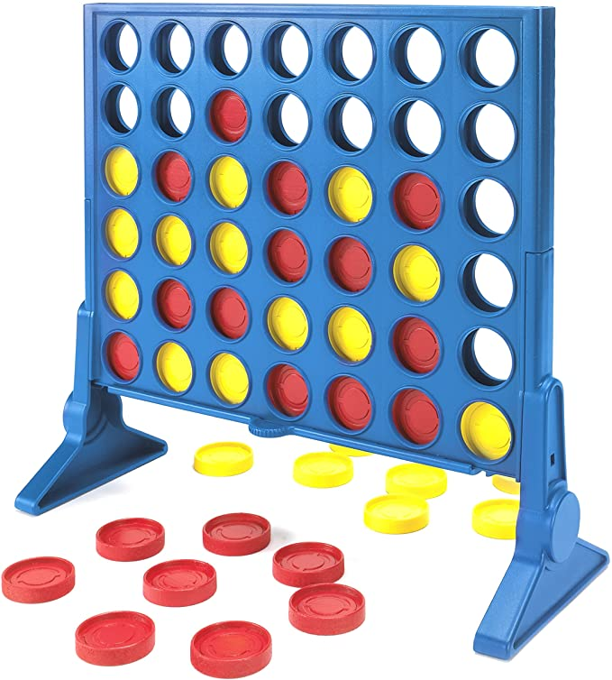
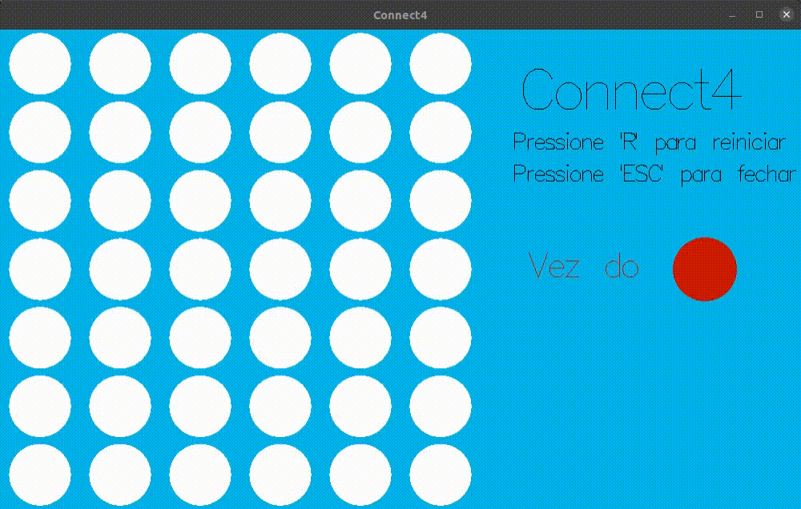

# Connect 4

### Como jogar?

Os jogadores escolhem uma cor e em seguida, revezam-se colocando os discos coloridos em uma grade suspensa verticalmente de sete colunas e seis linhas. As peças caem em linha reta, ocupando o menor espaço disponível na coluna. O objetivo do jogo é ser o primeiro a formar uma linha horizontal, vertical ou diagonal de quatro de seus próprios discos.

GUI do projeto em Haskell